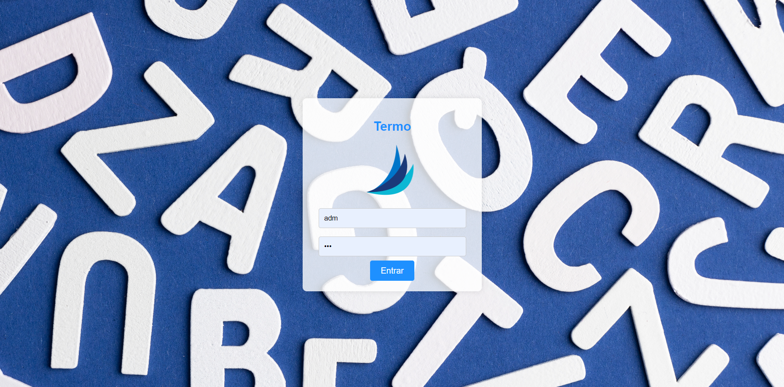
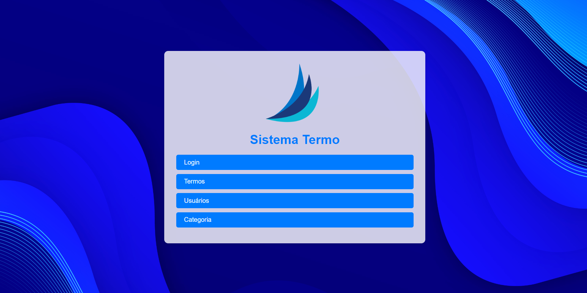
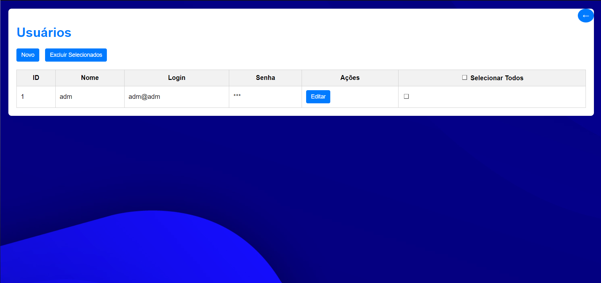
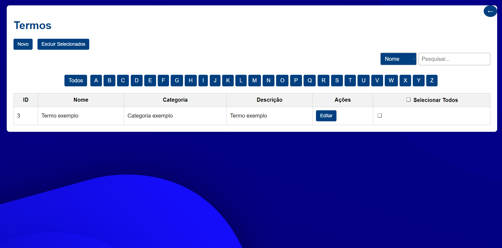
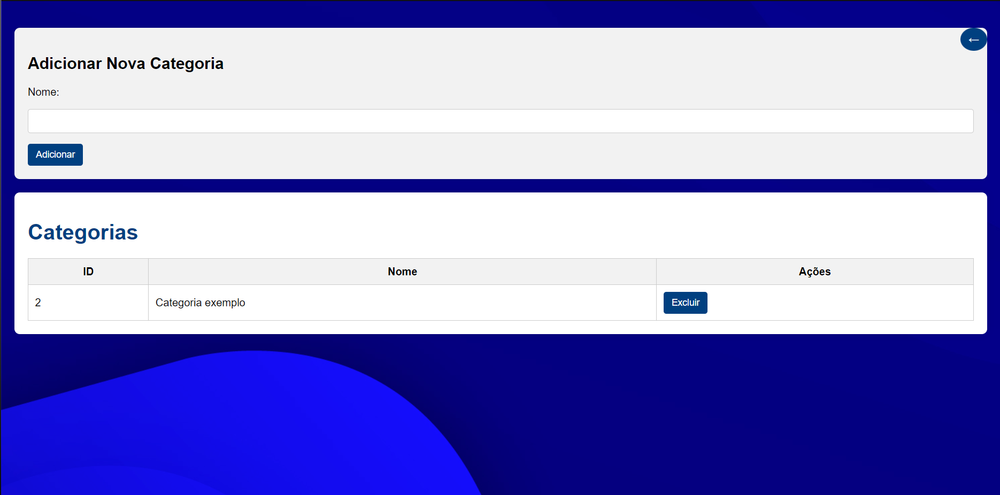

# Sistema de Gerenciamento de Termos

Este é um sistema para gerenciar termos, permitindo que os usuários façam login e acessem funcionalidades específicas.

## Funcionalidades

- **Login**: Os usuários podem acessar o sistema através de uma página de login.
- **Gerenciamento de Termos**: Após o login, os usuários podem visualizar e gerenciar termos.

## Estrutura do Projeto

- **database/db.php**: Arquivo de configuração para conexão com o banco de dados.
- **principal/login.php**: Página de login dos usuários.
- **principal/inicial.php**: Página inicial acessada após o login.
- **imagem/**: Diretório que contém as imagens utilizadas no sistema.
- **termo.sql**: Arquivo SQL contendo a estrutura do banco de dados.

## Configuração

1. **Clonar o Repositório**: Clone este repositório para o seu servidor local.

   ```bash
   git clone https://github.com/VitorGirottto/termo.git
2. **Configurar o Banco de Dados**: Utilize o arquivo termo.sql para criar o banco de dados necessário.

### Crie um banco de dados chamado termo.

Importe o arquivo termo.sql para o banco de dados para criar as tabelas necessárias.

Configurar a Conexão com o Banco de Dados: Verifique se as credenciais de acesso ao banco de dados no arquivo database/db.php estão corretas.
 ```bash
<?php
$host = 'localhost';
$dbname = 'termo';
$username = 'root';
$password = '';
?>
```
3. **Configurar o Servidor Web: Certifique-se de que o servidor web (por exemplo, Apache) esteja configurado para servir os arquivos deste projeto.**

Acessar o Sistema: Abra o navegador e acesse http://localhost/termo/principal/login.php para iniciar o sistema.

### Pode utilizar o usuário 

login: adm@adm

senha: adm

OBS: caso importar o arquivo termo.sql no respositório

## Tecnologias Utilizadas

PHP: Linguagem de programação utilizada para o backend.

MySQL: Banco de dados relacional para armazenar informações dos usuários e termos.

HTML/CSS: Estrutura e estilo das páginas web.

## Capturas de Tela

Tela de Login:



Tela Principal:



Tela de usuários:



Tela dos Termos:



Tela das Categorias:


